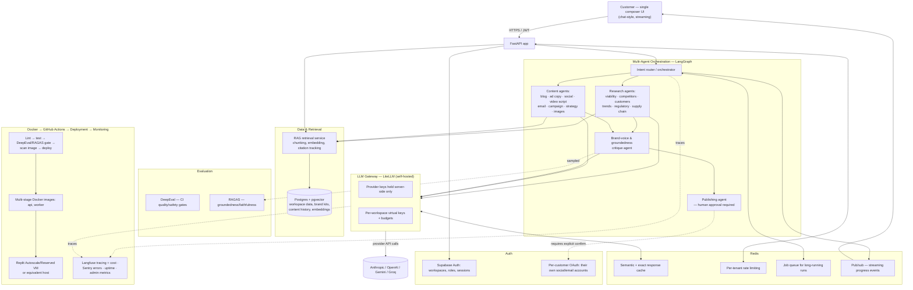

# Platform Rebuild — Strategic Brief & Build Specification

**Working title for the product throughout this document: "the Platform."** Branding/naming is intentionally left as an open decision in Part VIII — this document focuses on substance, not a name.

**Document purpose.** This is two things at once, on purpose:

1. A record of the strategic discussion — what was audited in the two existing repositories, what the market actually looks like in mid-2026, where the real gaps are, and the reasoning behind every major decision below.
2. A build specification ("superprompt") detailed enough to hand to Replit, Lovable, Claude Code, or a human engineering team and get a coherent result — not a vague vision document that a coding agent will fill in with its own defaults.

Both audiences — you, deciding whether the plan is right, and whatever builds it — should be able to read this end to end and know exactly what to do next.

**How to use this document.** Read Part 0 and Part I first; that's the urgent item and the "why a rebuild" evidence. Part II and III are the product/strategy reasoning. Part IV is the technical core. Part V is non-negotiable. Part VI is specifically for whoever is operating Replit/Lovable. Part VII is for whoever designs the UI. Part VIII is the list of things only you can decide.

---

## Part 0 — Act On This First: Exposed Credentials

The audit of both repositories found live, working API keys and credentials committed in plaintext `.env` files included in the uploaded project archives. This is the single highest-priority item in this entire document and has nothing to do with the rebuild — it needs to happen today, regardless of when the rebuild starts.

**What was found, by category (not reproduced here — values should never be copy-pasted into another document, including this one):**

| Repository | Exposed credential types |
|---|---|
| Marketing Agent (`.env`) | Gemini API key, SerpAPI key, Groq API key, Cohere API key, a Gmail address with its app password, a Hugging Face access token, and a full set of X/Twitter API credentials (consumer key, consumer secret, bearer token, access token, access token secret) |
| Research Ninja (`.env`) | A second Gemini API key, a second SerpAPI key, a second Cohere API key |

**What to do, today, in this order:**

1. Rotate every one of those credentials at the provider (Google AI Studio, SerpAPI, Groq Console, Cohere Dashboard, the Gmail account's App Passwords page, Hugging Face tokens page, and the X Developer Portal). Rotating means generating a new key/secret and revoking the old one — not just changing where it's stored.
2. Change the Gmail account password itself if that inbox is used for anything beyond sending automated mail, since an app password being exposed alongside the account name is functionally a credential leak on that mailbox.
3. If either repository was ever pushed to a **public** GitHub repo, treat the keys as fully burned regardless of git history cleanup — scrubbing history does not un-leak a key that was public even briefly, especially keys tied to billing (Gemini, Groq, Cohere, SerpAPI all meter usage to a paid account).
4. Check provider usage dashboards for the last 90 days for any spend or activity you don't recognize before rotating, since that's the only window to catch abuse.
5. Going forward: no secret of any kind ever goes into a file that is committed, uploaded, or pasted anywhere outside a secrets manager. Part IV and Part V specify exactly where keys live in the new architecture (answer: only inside the LLM gateway and the host's secret manager, never in application code, never in a frontend, never in a file the customer or a coding agent can read).

This is also the cleanest possible proof of why a patch-job isn't the right call here, and a preview of the standard the rest of this document holds the rebuild to.

---

## Executive Summary

**Verdict on viability:** rebuilding is the right call, and not just because the code is old. Both repositories are single-developer prototypes — Streamlit demo apps with no auth, no tests, no persistence beyond local CSVs and files, secrets in plaintext, and a "Research Ninja" that isn't actually wired into the Marketing Agent (it's an iframe pointing at a hardcoded local port; see Part I). None of that is a criticism of the original build — it's exactly what fast prototyping looks like — but none of it survives a single real customer, and patching it piece by piece would cost more than starting the application layer over on a real foundation while keeping the genuinely good parts: the content-type coverage, the platform-specific tone logic, and the six-lens research framework. Those are kept. Streamlit, the credential handling, the fake integration, and the sequential "call Gemini, hope it works" execution model are not.

**The strategic bet this document is built around:** the AI marketing-content space is crowded and largely commoditized — Jasper, Copy.ai, Writesonic and a dozen others all do "type a prompt, get a blog post / ad / social caption," and the documented complaint across that entire category in 2026 is that the output still reads as generic and needs heavy editing. Separately, the competitive-intelligence space (Klue, Crayon, Contify, AlphaSense) is real, valuable, and priced at $15,000–$40,000+ a year — squarely out of reach for the SMB/mid-market customer this product should target, and explicitly sales-battlecard-shaped rather than content-shaped. Nobody is sitting in the middle: a product where content generation is *grounded* in continuously-refreshed, citation-backed research about the customer's actual market, rather than the model inventing plausible-sounding claims. That middle is exactly what "Research Ninja powering the Marketing Agent" already is *conceptually* — it has just never been built as a real pipeline. Part II lays out the market evidence for this in detail.

**The architecture decision in one sentence:** Research Ninja stops being a separate app and becomes the retrieval/grounding engine inside a single multi-agent backend; the customer never sees two products, never sees a settings panel meant for a developer, and never sees a raw model picker or an API key field — they see one composer window, the way they'd expect from Claude, ChatGPT, or Gemini, with the agentic work (research, drafting, fact-checking, brand-voice review) happening behind a streaming progress indicator.

**The build-tool decision:** Lovable is a frontend generator with a Supabase backend underneath it; it cannot run a persistent FastAPI multi-agent service, Redis-backed workers, or Docker images. Replit can actually run that stack. The recommendation in Part VI is to build the backend (FastAPI, the agent graph, the LLM gateway, Redis, the worker queue) on Replit or with Claude Code, and use Lovable only if at all for a thin frontend that talks to that backend over its public URL — not as the home for the whole system. Both paths are laid out honestly in Part VI, including the lighter-weight option if you'd rather stay fully inside Lovable's Supabase model at the cost of dropping some of the architecture as originally specified.

**Everything below this point exists to make those four paragraphs defensible and buildable.**

---

## Part I — What's Actually In The Two Repositories

This section is the evidence base for "rebuild, don't patch." It's specific on purpose — vague claims like "the code is outdated" don't help whoever builds this next understand what *not* to repeat.

### I.1 — Marketing Agent

The app is a Streamlit UI (`ui.py`) with a sidebar radio nav across nine pages, backed by an `agents/` folder of standalone functions that each build a prompt string and call `gemini_text_model.generate_content(prompt)` directly. There is no FastAPI layer despite the requested architecture starting with one — `main.py` is a single line that shells out to `streamlit run ui.py`. Specific issues found:

- **No real orchestration.** `MarketingAgent.run_campaign()` is one large method with a chain of `if "x" in actions:` blocks that each call a generation function and stuff the result into a dict. There's no planning, no retries, no shared context between steps, and no way for one agent's output to inform another beyond manually threading dict keys through `modifications`.
- **A broken import that would crash on use.** `agents/generate_campaign.py` imports `image_generator` from `agents.generate_images_with_gemini`, but that module only defines the `ImageGenerator` *class* — the instance named `image_generator` is actually created later, inside `MarketingAgent.py`. Calling `generate_campaign()` directly (as opposed to going through the page that happens to import things in the right order first) raises `ImportError`. This kind of latent bug is what happens when there's no test suite and no type checking.
- **Hardcoded destinations for real customer actions.** `social_media/social_media_manager.py` sends every "email" platform post to one literal hardcoded address (`earlyforestfiredetectionsystem@gmail.com`) regardless of what the user intended, and `youtube_uploader.py` posts every "video" using one hardcoded developer-owned video file and a local-machine OAuth flow (`flow.run_local_server(port=8080)`) that opens a browser on whatever machine the server happens to be running on. Neither of these is fixable with a config change — the entire posting model assumes one developer's accounts, not per-customer authorized channels.
- **`requirements.txt` is UTF-16 encoded** (each character followed by a null byte), which is very likely a Windows editor artifact and may not even install cleanly with a plain `pip install -r requirements.txt` depending on the environment's locale handling — a small but telling sign of how unattended this repository has been.
- **`render.yaml` deploys a Streamlit app**, not the FastAPI service the target architecture calls for, and the secrets discussed in Part 0 are sitting in the repo root next to it.
- **The prompts themselves are good raw material.** The platform-specific tone guidance in `generate_ad_copy.py` (distinct voice rules for Twitter, LinkedIn, Instagram, Facebook, YouTube, Email) and the structured-then-final two-pass pattern used across blog, video script, ad copy, and social post generation (produce a structure → let the user adjust it → only then generate the full asset) are genuinely sound product ideas. They're kept; the execution around them is not.

### I.2 — Research Ninja

This one is further along architecturally than Marketing Agent in one specific way — there is an actual `backend/api.py` built on **FastAPI**, with CORS middleware and Pydantic request models. It is just never used: the live app (`app.py`) is a separate, self-contained Streamlit monolith that calls the backend *functions* directly in-process and never talks to the FastAPI service over HTTP. The `utils/integration_helper.py` client class that's supposed to call that API points at `http://127.0.0.1:5000` — a hardcoded localhost address that only works if both processes happen to be running on the same machine. This is the FastAPI-shaped skeleton of the right idea, abandoned mid-build.

Other findings:

- **Customer-facing API key input fields.** The sidebar's "Advanced Settings" panel has live text inputs where the *end user* types in their own SERP/Gemini/Cohere API keys, stored in a class attribute literally named `SECURE_STORAGE` that is just an in-memory Python dict (`utils/api_validator.py`). This is the exact opposite of what you've asked for — it's a developer-facing settings panel wearing a customer-facing UI, and it's also not secure storage in any sense (no encryption, lost on restart, visible to anyone with process access).
- **CORS wildcard with credentials.** `backend/api.py` sets `allow_origins=["*"]` together with `allow_credentials=True`. Browsers actually reject that exact combination at the spec level, but it's a clear sign the CORS config was copy-pasted rather than considered.
- **Direct, unguarded provider calls.** `ai_integration.py` calls the Gemini and Cohere REST endpoints directly with `requests.post(...)`, hardcoding `gemini-1.5-pro` (now a legacy model) as the model string, with no caching, no centralized retry/fallback policy, and no usage metering per user.
- **Scraping as the only research source.** `backend/scraper.py` does direct `requests` + `trafilatura`/`BeautifulSoup` scraping with rotating user agents — a fragile pattern that degrades over time as sites add bot defenses, and one with real terms-of-service exposure at scale. It works as a prototype; it isn't a defensible production data source on its own.
- **The six-lens research framework is the best asset in either repository.** Business viability, competitor analysis, customer/audience analysis, trend analysis, regulatory analysis, and supply-chain analysis, run from a single query, is a genuinely well-thought-out information architecture — better, frankly, than what most of the AI content tools surveyed in Part II offer. This structure is kept wholesale as the backbone of the new Research layer; only the execution (scraping → one LLM call → display) is replaced with the RAG pipeline in Part IV.

### I.3 — The "Integration" Between Them

`frontend/research.py` in Marketing Agent — the page that's supposed to be where the two products meet — is this in its entirety:

```
st.markdown('<iframe src="http://localhost:8505" width="100%" height="700px"></iframe>', unsafe_allow_html=True)
```

That's it. Research Ninja isn't called, queried, or integrated — it's embedded as a webpage pointing at a port number that only exists if someone happens to be running both apps on the same machine at the same time. There is no shared data model, no shared session, and no way for a piece of research to actually feed a piece of generated content. This is the single clearest piece of evidence that "Research Ninja is a part of Marketing Agent and the Agent depends on it" is currently true only in intent, not in code — which is exactly the problem Part IV's architecture solves for real.

### I.4 — What Survives The Rebuild

To be concrete about what's *not* being thrown away:

- The six research lenses (business viability, competitors, customers, trends, regulatory, supply chain) as the Research layer's information architecture.
- The structure-then-full-asset two-pass generation pattern for long-form content types.
- The platform-specific tone/format rules for ad copy and social posts (as data, not as a giant prompt string — see Part IV).
- The content-type breadth itself: blog, ad copy, social post, video script, hashtags, campaign plan, strategy doc, images, monitoring/reporting. The new system covers all of these and adds the ones listed in Part III.

Everything else — Streamlit, the credential model, the iframe integration, the sequential dict-passing orchestration, the CSV-based fake monitoring data, the hardcoded posting destinations, the client-facing key inputs — is replaced.

---

## Part II — Market Research: Where The Gaps Actually Are

This section summarizes research conducted into the current (2026) competitive landscape across both halves of this product — AI marketing-content generation, and competitive/market intelligence tooling — and states the specific gap the rebuilt product should aim at. Company names below are cited as factual market reference points, not as a suggestion to imitate them.

### II.1 — The AI content-generation landscape

The category is mature and crowded. Jasper, Copy.ai, Writesonic, Surfer SEO, Scalenut, Frase, and HubSpot's Content Hub all compete on a similar core loop: describe what you want, choose a template, get a draft. The differentiation that's actually happening in 2026 is in three places, not in raw generation quality:

- **Brand-voice training** — letting the customer upload existing content so output matches their tone — is now table stakes (Jasper's "Brand Voice," Copy.ai's "Infobase"), not a differentiator. It should be treated as a baseline requirement, not a feature to advertise.
- **Workflow breadth beyond a single asset** — Copy.ai has explicitly repositioned around "GTM AI workflows" (sales emails, outreach sequences, not just content), and HubSpot's advantage is that content is wired directly to CRM/attribution data. The lesson: a tool that only produces isolated assets, disconnected from what happens after, is competing on the most commoditized axis.
- **A new, distinct trend worth tracking but not building for yet** — several 2026 entrants (most visibly "Sight AI") are building "AI visibility" / GEO tracking: monitoring how a brand is described when people ask ChatGPT, Claude, or Perplexity about it, as opposed to classic Google-rank SEO. This is real and growing but is a fundamentally different data problem (querying and parsing other companies' AI products, not generating content). It's flagged in Part VIII as a credible v2+ feature, explicitly out of v1 scope.

**The complaint that shows up across nearly every comparison and review of this entire category, regardless of vendor, is the same one:** AI-generated marketing copy "feels generic" and needs heavy manual editing, especially for anything beyond short-form social/ad copy. That complaint exists *because* almost none of these tools ground their output in anything beyond the prompt and (at best) a brand-voice sample. They don't research the customer's actual market before writing about it. That is the exact gap Research Ninja, done properly, closes.

### II.2 — The competitive/market-intelligence landscape

Klue and Crayon are the category leaders, and they are explicitly built for one job: arming sales teams with battlecards inside Salesforce, with enterprise contracts reported in the $15,000–$40,000+/year range, multi-week implementations, and a dedicated internal owner expected to maintain the system. AlphaSense plays in an adjacent, even more expensive enterprise-research tier (reported north of $500M ARR at a multi-billion-dollar valuation), aimed at hedge funds, banks, and Fortune-500 strategy teams — not the audience this product is for. Below that tier sit lighter tools (Kompyte/Semrush, Contify, Similarweb, Owler, Visualping) that handle pieces of the job — page-change monitoring, news aggregation — without the synthesis layer.

The single most useful piece of market evidence found in this research is a recurring 2026 observation, made independently by multiple sources covering this category: AI agents can now competently do the *first level* of competitive-intelligence work — competitor page summaries, news triage, change detection — meaning a lean, in-house, agent-built research capability has become viable for small teams in a way it explicitly was not a year or two earlier. That is a direct, external validation of exactly what Research Ninja is trying to be: not a $20,000/year battlecard platform, and not a toy scraper, but a real multi-agent research engine sized for SMB/mid-market budgets.

### II.3 — The gap, stated plainly

No product surveyed combines all three of these in one coherent experience at SMB/mid-market pricing:

1. Continuously-refreshed, multi-lens, citation-backed research about the customer's specific market (what Research Ninja's six lenses already aim at).
2. Content generation that is *grounded* in that research rather than invented from the model's general knowledge (what neither Jasper-class tools nor Klue-class tools do — one generates without researching, the other researches without generating).
3. A single, clean, conversational interface, with no visible seam between "doing research" and "writing the content," priced for a business that would never sign a $20k/year CI contract but also isn't satisfied with generic AI copy.

That's the product. It also directly answers the "I don't want this to feel like AI slop" requirement at the strategy level, not only the visual-design level addressed in Part VII: content that's traceably grounded in real, current, cited information about the customer's actual market reads differently than content extruded from a generic prompt template, because it *is* different — it has facts in it that a generic tool couldn't produce without doing the research first.

---

## Part III — Product Decisions: What Goes, What Stays, What Gets Added

### III.1 — The single-surface principle

The customer signs in once, lands in one workspace, and sees one composer — visually and behaviorally in the spirit of Claude, ChatGPT, or Gemini's main screen, not a multi-page dashboard with a sidebar of nine separate tools. Behind that one composer, an intent-routing step (part of the agent graph in Part IV) decides whether the request is "write me a LinkedIn post about X," "research my top three competitors," "plan next quarter's campaign," or some mix, and dispatches to the right specialist agents. Research Ninja's six lenses and the Marketing Agent's content generators are not two products glued together; they're two families of specialist agents sharing one orchestrator, one workspace data model, and one knowledge base.

What the customer *does* get as visible, named settings — because these are genuinely the customer's business inputs, not implementation details:

- A **brand kit**: name, voice/tone description, example content, do-not-say list, logo/colors for any generated visuals.
- **Audience and market presets** tied to their workspace, reusable across requests instead of re-typed every time.
- **Connected channels**, added by the customer authorizing their own social/email accounts via OAuth (Part V) — never the platform's own developer credentials.
- **Content history and a saved research library** ("what do we already know about Competitor X" persists and gets reused, not re-researched from zero every time).
- **Plan/usage** — seats, generation volume, billing.

What the customer never sees: a model picker, a temperature or token-limit slider, a raw API key field of any kind, prompt text, agent logs, or anything that exposes *how* the system works rather than *what it can do for them*. That entire category of control lives in an internal admin surface (Part IV, Monitoring) that customers never reach.

### III.2 — Feature matrix

| Category | Capability | Status |
|---|---|---|
| Research & Intelligence | Business viability analysis | Carried over from Research Ninja, rebuilt on RAG (Part IV) |
| | Competitor analysis | Carried over, rebuilt; add structured competitor profiles that persist and update, not one-off text blobs |
| | Customer/audience analysis | Carried over, rebuilt |
| | Market trend analysis | Carried over, rebuilt |
| | Regulatory/compliance scan | Carried over, rebuilt |
| | Supply chain analysis | Carried over, rebuilt |
| | Saved, reusable knowledge base per workspace | **New** — the actual fix for "research happens once and evaporates" |
| | Source citation on every research claim | **New** — non-negotiable; see Part IV's RAG section |
| Content Generation | Blog posts (structure-then-full-draft) | Carried over pattern, rebuilt |
| | Ad copy, per platform | Carried over, rebuilt; tone rules become structured config, not prompt strings |
| | Social posts, per platform | Carried over, rebuilt |
| | Video scripts | Carried over, rebuilt |
| | Email copy | Carried over, rebuilt |
| | Hashtag sets | Carried over, rebuilt |
| | Campaign concepts | Carried over, rebuilt |
| | Marketing strategy documents | Carried over, rebuilt |
| | Product/ad imagery | Carried over (replace ad-hoc scraping/Gemini-SVG hack with a defined image-gen provider) |
| | Every output grounded in the workspace's research library where relevant | **New** |
| Planning | Campaign/content calendar | **New** — implied by "planning" but not actually built in the legacy app beyond a text generator |
| Publishing | Manual export/copy to clipboard, all content types | **New baseline for v1** |
| | Direct-publish via customer-authorized OAuth (social, email) | **v1.5** — deliberately deferred; see Part VIII for why |
| | Mandatory human approval step before any external-facing action | **New, non-negotiable from day one** once direct publish exists |
| Monitoring/Reporting | Campaign performance dashboard | Rebuilt on real data sources/manual logging instead of static demo CSVs |
| | AI-generated commentary on metrics | Carried over concept, rebuilt |
| Collaboration | Multi-seat workspaces, roles (Owner/Admin/Editor/Viewer) | **New** |
| | Approval/comment flow on drafts | **New** |
| Quality & Trust | Automated brand-voice/quality score before content is shown | **New** |
| | Automated factual-groundedness check on research-derived claims | **New** |
| | Visible "last researched on" freshness indicator | **New** |

### III.3 — What is explicitly cut, and why

- **Streamlit** — fine for an internal prototype; cannot do per-tenant auth, RBAC, streaming agent UX, or the visual quality bar this needs.
- **The iframe "integration"** — replaced by the unified agent graph in Part IV.
- **Client-facing API key fields and a model picker** — replaced by the LLM gateway (Part IV) holding all provider keys server-side, invisible to the customer.
- **Posting from one shared developer-owned social/email account on every customer's behalf** — a security, legal (ToS), and trust problem the moment there's more than one customer. Replaced by per-customer OAuth connections, and deferred to v1.5 regardless (Part VIII) so v1 ships without it.
- **CSV-seeded fake monitoring data** — replaced by real connector-based or manually-logged metrics.
- **One god-class orchestrator with `if/elif` dispatch** — replaced by an explicit agent graph (Part IV) where each step's inputs, outputs, and failure handling are typed and visible.

---

## Part IV — Target Architecture

The order below follows the sequence you specified. In practice these layers aren't strictly linear — the diagram shows how a request actually flows, with the gateway and cache sitting in the middle of several layers rather than at one point in a line.



### IV.1 — FastAPI

The application layer is a single FastAPI service (plus background workers, same codebase) with:

- Versioned routes (`/api/v1/...`), Pydantic v2 models for every request/response so the schema is enforced, not just hoped for.
- A clean separation between **request/response endpoints** (fast: auth, workspace CRUD, fetching saved content, kicking off a job) and **long-running agent runs**, which are never executed inline inside a request — they're handed to the background worker queue (Part IV.6) and the client follows progress over the streaming channel (Part IV.7). Nothing about a multi-step research-then-write agent run belongs inside a synchronous HTTP request/response cycle; the legacy code's pattern of calling `generate_content()` directly inside a Streamlit button handler is exactly the pattern to avoid.
- Dependency-injected, per-request Postgres sessions and a per-request authenticated workspace context, so every downstream query is automatically scoped — there should be no code path where forgetting a `WHERE workspace_id = ...` clause is possible (reinforced at the database level too — see IV.2).
- OpenAPI schema generation kept on for internal/admin use, explicitly **not** exposed as a public "developer settings" surface to customers.

### IV.2 — Auth

**Recommendation: Supabase Auth as the day-one identity provider**, with the data model built so WorkOS can be added later purely as an add-on for enterprise SSO/SAML/SCIM — not as a migration.

Why this specific choice, not a generic "use an auth provider": this product is Postgres-centered already (pgvector lives there too — IV.3), and Supabase Auth's main real advantage is that it issues JWTs that plug directly into Postgres Row-Level Security, so tenant isolation is enforced by the database itself, not only by application code remembering to filter correctly. Every table that holds workspace-scoped data gets an RLS policy keyed on `workspace_id`, so even a bug in the FastAPI layer can't leak one workspace's content or research into another's queries. Supabase Auth's free tier (50,000 MAU) comfortably covers early growth, and its weak point — SSO/SCIM for enterprise buyers — is specifically the one thing WorkOS is built to bolt on, cleanly, the day a real enterprise prospect asks for it. Don't build SAML/SCIM yourselves now; don't pay for it before anyone's asked for it either.

Two distinct authorization concerns, kept separate:

1. **Platform login** — who can sign into this workspace, and what role they have in it (Owner, Admin, Editor, Viewer, Billing). This is Supabase Auth + your own `members`/`roles` tables.
2. **Channel authorization** — a customer connecting *their own* X/LinkedIn/Gmail/etc. account so the platform can publish on their behalf. This is a completely separate OAuth flow per channel, tokens encrypted at rest, scoped to that one workspace, revocable by the customer at any time, and never confused with platform login. This is the direct fix for the legacy app's hardcoded shared-account posting problem (Part I.1, Part III.3).

### IV.3 — Vector DB

**Recommendation: pgvector inside the same Postgres instance**, not a separate vector database, at least through the range this product will operate in for a long time (the consistent finding across current benchmarking is that pgvector is the right default under roughly 5–10 million vectors when you're already running Postgres, with materially less operational surface than running a second database service). One database to back up, monitor, secure, and reason about for RLS is a real simplicity win, not just a cost one.

**Migrate to Qdrant specifically when** (not before): vector count consistently exceeds ~5 million, or filtered/hybrid search latency becomes a measured problem, or a single enterprise customer's research corpus alone is large enough to be a noisy neighbor to everyone else's queries. Document this trigger in the codebase itself (a comment, a runbook entry) so it's a deliberate decision later, not a scramble.

### IV.4 — RAG

This is the layer that makes the strategic bet in Part II real, so it gets its own detail rather than a one-line "use RAG":

- **Ingestion sources**: web research performed by the research agents (IV.5), customer-uploaded brand materials, and (later) connected analytics data. Each chunk is stored with `workspace_id`, `source_url`, `retrieved_at`, and a content hash, so re-research can detect what's changed rather than blindly re-fetching everything.
- **Freshness matters more here than in a typical RAG system.** A blog's RAG corpus is mostly static; this product's research corpus goes stale — a competitor's pricing page from four months ago is actively misleading, not just slightly outdated. Every retrieved chunk surfaces its `retrieved_at` date, both to the generating agent (so it can say "as of [date]") and to the customer (the "last researched on" indicator from Part III.2). A scheduled background job re-checks high-value sources (tracked competitors, the customer's own market category) on a cadence rather than only on-demand.
- **Citations are mandatory, end to end.** Every factual claim a research or content agent makes that came from retrieval carries a source reference through to the final output. This is enforced structurally — agents emit claims as `(text, source_ids[])` pairs internally, not free-text paragraphs with citations bolted on afterward — and it's what RAGAS's groundedness/faithfulness scoring (IV.9) actually measures against.
- **Retrieval, not memorization, for anything time-sensitive.** Agents are explicitly instructed (and evaluated, IV.9) to retrieve before asserting any fact that could have changed — pricing, headcount, recent news, regulatory status — rather than relying on the model's general training knowledge, which is exactly the failure mode that makes generic AI content tools produce confidently wrong claims.

### IV.5 — Multi-Agent Orchestration

**Recommendation: LangGraph**, not CrewAI, as the production orchestration framework, with CrewAI acceptable only for rapid internal prototyping of a brand-new agent before it's hardened into the LangGraph graph. The reasoning: this system needs durable, stateful, resumable runs (a research-then-write job might take minutes and touch a dozen tool calls — it has to survive a worker restart partway through), native streaming of intermediate steps (IV.7), and a Postgres-backed checkpointer so run state lives in the same database as everything else. That combination is specifically what LangGraph is built for and is the consistently-recommended choice for this kind of workload in current comparisons, whereas CrewAI's role-based "crew" model is optimized for getting a multi-agent prototype running quickly, not for this level of control over failure recovery and state.

**Agent roster** (each a node or sub-graph in LangGraph, not a hardcoded `if/elif` chain like the legacy `MarketingAgent.run_campaign`):

- **Orchestrator / intent router** — classifies the incoming request, decides which specialist agents are needed, and assembles the final response. This is what replaces nine separate Streamlit pages with one composer.
- **Six research specialists** — business viability, competitor analysis, customer/audience analysis, trend analysis, regulatory analysis, supply chain analysis — each with web search and retrieval as tools, writing structured findings with citations into the workspace knowledge base (IV.4), not just returning text to display once.
- **Content specialists** — one per content type (blog, ad copy, social, video script, email, campaign concept, strategy doc), each retrieving relevant workspace research before drafting, and each respecting the brand kit (Part III.1) as a structured input, not a string spliced into a giant prompt.
- **Brand-voice & groundedness critique agent** — reviews every draft against the brand kit and against its cited sources before the customer ever sees it; this is the agent whose pass/fail feeds the visible quality score in Part III.2 and is sampled by RAGAS in CI (IV.9).
- **Publishing agent** — the only agent with permission to call an external write action (post, send), and it never executes that action without an explicit, separate human confirmation step in the UI first. This is the structural fix for the OWASP "Excessive Agency" risk (Part V) and the direct replacement for the legacy code's silent autonomous posting.

Tools (web search, retrieval, the scraper, future analytics connectors) are defined once and shared across agents, ideally behind the **Model Context Protocol (MCP)** convention rather than bespoke per-agent function signatures — this keeps the tool layer swappable and testable independent of any one agent.

### IV.6 — Redis

One Redis instance, four distinct jobs, worth naming separately so none of them get silently dropped during implementation:

1. **Cache** for the LLM gateway (IV.7) — both exact-match and semantic caching of model responses, which is the single highest-leverage cost and latency lever available (industry reporting puts realistic savings at 30–50% of LLM spend once semantic caching is in place for any workload with repeated/similar prompts, which marketing content generation has plenty of).
2. **Rate limiting / quota enforcement** — sliding-window counters per workspace, tied to plan tier, so one workspace can't exhaust shared capacity or run up an unbounded bill (this is also a direct mitigation for the OWASP "Unbounded Consumption" risk in Part V).
3. **Job queue** for the background worker (an asyncio-native queue such as Arq pairs naturally with FastAPI; Celery is the more battle-tested alternative if the team already knows it) — every multi-step agent run is a queued job, not a blocking request.
4. **Pub/sub** carrying step-by-step progress events ("researching competitor pricing," "drafting outline," "checking brand voice") from the worker to the API layer, which the streaming channel (IV.7) forwards to the browser.

### IV.7 — LLM Gateway and Streaming

The architecture you specified jumps from Redis to Streaming; in practice there's a load-bearing piece in between that the legacy code never had at all, and it's the direct mechanical answer to "no exposed keys, no developer settings visible to customers": **a self-hosted LLM gateway (LiteLLM)** sitting between every agent and every model provider.

What it does: holds every provider API key (Anthropic, OpenAI, Gemini, Groq, whatever the model roster ends up being) entirely server-side, inside the gateway's own configuration and the host's secret manager — never in application code, never sent to a browser, never typed into any UI, by customer or by staff, ever again. It issues **virtual keys per workspace** with a budget cap, so usage and cost are attributable and bounded per customer automatically. It normalizes the response format and the streaming protocol across providers, so the rest of the system never branches on "if Gemini, do X, if Cohere, do Y" the way the legacy `ai_integration.py` does. And it provides automatic fallback (if one provider errors or rate-limits, retry against the next) without any application-level logic. Start self-hosted and open-source (LiteLLM); the documented migration trigger to a managed option like Portkey is when monthly LLM spend or compliance requirements justify built-in PII redaction and audit trails — not before, since that's added cost and another vendor relationship for capability you don't need yet.

**Streaming**, then, is genuinely simple on top of that: Server-Sent Events (or WebSocket, either is fine) from FastAPI to the browser, carrying two kinds of events — token-level text as the model generates it (the part that makes the composer feel like Claude/ChatGPT/Gemini rather than a spinner-then-dump interface) and structured "agent step" events from the Redis pub/sub channel (IV.6) showing real progress through a multi-agent run. The second part is a genuine UX differentiator over every legacy page's "please wait" spinner, and it's also what makes a multi-minute research-then-write job feel trustworthy instead of stuck.

### IV.8 — Evaluation

Two complementary tools, used for two different jobs, both gating the CI pipeline (IV.10) rather than being optional manual steps:

- **DeepEval** for general-purpose, pytest-native quality and safety checks — hallucination, toxicity, format compliance, brand-voice adherence on a fixed set of golden test cases per content type. These run on every pull request and **block the merge** on failure, the same way a broken unit test would.
- **RAGAS** for the RAG-specific metrics that matter most given Part IV.4's emphasis on grounded claims: faithfulness (does the output actually match what was retrieved) and context precision/recall (is retrieval finding the right material in the first place). This is run as a sampled, scheduled job against live production traces as well as in CI, since retrieval quality can drift even when the code hasn't changed.
- **A golden-set regression suite**, maintained deliberately: a fixed set of representative briefs per content type with known-good example outputs, re-run on every change so a quality regression is caught before a customer sees it, not after. This is the concrete mechanism behind "generates great output, accuracy" — not a vibe, a gate.

### IV.9 — Docker

Multi-stage builds, minimum two images (the FastAPI API process and the background worker process — they scale independently and shouldn't ship as one monolithic image), non-root container user, pinned base image versions (no floating `latest` tags), a real `.dockerignore` so no `.env`, no `.git`, and no local virtualenv ever ends up inside a built image, and image scanning (Trivy or Grype) as part of the same CI pipeline that builds them — not a separate, skippable step.

### IV.10 — GitHub Actions

A single pipeline, roughly: lint and type-check → unit tests → the DeepEval/RAGAS evaluation gate (IV.8) → build and scan the Docker images → push to a registry → deploy. Branch protection requires this pipeline to pass and requires a review before merge to `main`. **Secret scanning (gitleaks or GitHub's native secret scanning) runs on every push and every pull request** — this single control is what would have caught Part 0's incident before it ever happened, and it's non-negotiable given that history.

### IV.11 — Deployment

Covered concretely in Part VI alongside the Replit/Lovable decision, since the right answer here is inseparable from which build tool is actually operating the infrastructure. The short version: a host that can run a real, persistent Python process plus a worker plus Redis (Replit's Autoscale/Reserved VM deployments, or a conventional host like Fly.io/Render once you've outgrown that), managed Postgres (Supabase or Neon), and managed Redis (Upstash is a natural fit for a serverless-leaning deployment).

### IV.12 — Monitoring

**Langfuse** for LLM/agent-specific observability — every agent run traced end to end with the exact prompt, retrieved context, model, cost, and latency, searchable when a customer reports a bad output (this doubles as the production half of the evaluation story in IV.8, since DeepEval/RAGAS cover pre-deploy testing and Langfuse covers what's actually happening live). Standard application monitoring alongside it — error tracking (Sentry-class tool), uptime checks, structured logs. All of this lives behind an **internal admin view that customers never see** — this is exactly where "settings meant for developers" belong, satisfying that requirement architecturally rather than just by convention.

---

## Part V — Security Requirements (Non-Negotiable)

These aren't suggestions to weigh against deadlines. Treat every item below the same way Part 0's incident should be treated: as a release blocker, not a backlog item. They're organized around the **OWASP Top 10 for LLM Applications (2025/2.0)**, mapped specifically to what this product actually does, plus the classic application-security items an agentic SaaS product can't skip.

| OWASP LLM risk | How it applies here | Required mitigation |
|---|---|---|
| LLM01 — Prompt Injection | Research agents retrieve and read external web content (Part IV.4/IV.5) — a competitor's page or a scraped article is untrusted input that could contain hidden instructions | Treat all retrieved content as data, never as instructions, at the prompt-construction level; never let retrieved text alone trigger a tool call or an external action; the publishing agent's mandatory human-confirm step (IV.5) is the backstop even if injection succeeds upstream |
| LLM02 — Sensitive Information Disclosure | Brand kits, draft campaigns, and connected-account tokens are exactly the kind of data customers don't want leaking between workspaces or back out through model output | Postgres RLS per workspace (IV.2) as the structural backstop; never include another workspace's data in any prompt context; encrypt OAuth tokens at rest; no customer content used to fine-tune or improve any third-party model without explicit, separate opt-in |
| LLM03 — Supply Chain | The legacy app pulls in a long, unaudited list of dependencies (Part I) with no scanning | Dependency and container scanning in CI (IV.9/IV.10); pin versions; review new dependencies before adding, especially anything with network or filesystem access |
| LLM04 — Data and Model Poisoning | Lower risk here since you're not training/fine-tuning a model on user data, but the research corpus itself could be poisoned by an adversarial competitor planting misleading content for your scraper to find | Source diversity and basic credibility weighting in the research agents; citations visible to the customer so a bad source is checkable, not hidden inside an unattributed claim |
| LLM05 — Improper Output Handling | Generated content can include HTML/Markdown (the legacy blog generator outputs raw HTML) that could carry injected scripts if ever rendered unsanitized | Sanitize/escape all generated HTML before rendering anywhere, including in any preview pane or exported file |
| LLM06 — Excessive Agency | This is the single most relevant risk given the legacy app's actual behavior: agents that post to Twitter and send email **with no human in the loop, using one shared developer-owned account for every customer** | The publishing agent never executes a write action without an explicit per-action human confirmation; channel credentials are customer-owned via OAuth (IV.2), never platform-owned; least-privilege OAuth scopes only (e.g., request posting permission, not full account access) |
| LLM07 — System Prompt Leakage | Agent instructions and the brand-kit injection logic shouldn't be extractable by a clever customer prompt | Don't put anything in a system prompt you'd be uncomfortable having a user eventually see; treat "don't leak the prompt" as defense-in-depth, not the actual control |
| LLM08 — Vector and Embedding Weaknesses | Directly relevant the moment there's more than one tenant sharing infrastructure, which is day one here | RLS-enforced filtering on every vector query by `workspace_id`, never relying on the application layer alone to scope retrieval (IV.2, IV.3) |
| LLM09 — Misinformation | The whole point of the RAG layer (IV.4) is reducing this, but it isn't eliminated | Mandatory citations end to end; RAGAS faithfulness scoring in CI and in production sampling (IV.8, IV.12); visible freshness dates so a customer can judge currency themselves |
| LLM10 — Unbounded Consumption | The legacy app has zero rate limiting or cost ceiling anywhere | Per-workspace budgets enforced at the LLM gateway (IV.7) and Redis-backed rate limiting (IV.6); hard ceiling with a clear customer-facing message, not a silent failure or a runaway bill |

**Beyond the LLM-specific list, the baseline that any enterprise-grade SaaS needs regardless of AI content:**

- TLS everywhere; encryption at rest for the database and for any object storage (generated images, exports).
- Secrets live only in the host's secret manager and the LLM gateway's own config — never in code, never in a repo, never in a `.env` committed anywhere (the rule that Part 0 exists because of).
- Least-privilege database roles: the application's runtime DB user should not be a superuser, and should not be able to do anything beyond what the application actually needs.
- Structured audit logging of who did what, when, especially for anything that touches another workspace's settings, billing, or a publish action.
- A real data-retention and deletion policy, including a path for a customer to fully delete their workspace's data (research corpus, generated content, connected-account tokens) on request.
- Dependency and secret scanning in CI as a hard gate (IV.10), not a dashboard nobody checks.
- A documented incident-response plan for exactly the kind of event Part 0 describes, so the next time it doesn't take a manual repository audit to discover.

This is also the honest place to separate two different meanings of "enterprise-grade": **engineering rigor** (everything above) is achievable and required from day one. **Formal compliance certification** (SOC 2 Type II, HIPAA, ISO 27001) is a months-long audit-and-process commitment, not a configuration setting, and is revisited explicitly in Part VIII rather than assumed here.

---

## Part VI — Build Execution: Working With Replit and Lovable

### VI.1 — The honest comparison, for this specific architecture

Lovable generates a React/Tailwind frontend and wires it to Supabase for the database, auth, and simple backend logic (Edge Functions). It does not run a persistent FastAPI process, a background worker, Redis, or arbitrary Docker images — when a build needs custom server-side logic beyond CRUD, Lovable itself documents that you end up writing it yourself or working around it with Edge Functions. Replit can actually run the stack as specified: it spins up real FastAPI/Python processes, supports Postgres, has reserved/autoscale deployment targets, and (as of early 2026) carries a SOC 2 Type II certification — a real, documented compliance posture neither Lovable nor Bolt has matched as of this writing. The tradeoff multiple independent comparisons converge on: Lovable produces a more polished UI faster; Replit gives real backend control at the cost of more hands-on iteration and a billing model (effort-based) that's less predictable than Lovable's flat credits.

**Recommendation, given the architecture in Part IV: build the backend on Replit (or with Claude Code, if you want full manual control over the security-sensitive pieces — the LLM gateway config, the RLS policies, the CI pipeline), and either let Replit also generate the frontend, or use Lovable purely for frontend polish against the already-running FastAPI backend's public URL.** Don't ask Lovable to be the home for the agent graph, the gateway, the worker queue, or Docker/CI — that's not what it's built to hold, and forcing it will produce a brittle result that fights the platform the whole way.

### VI.2 — Two honest paths, pick one explicitly before starting

**Option A — Replit-primary (matches the architecture in Part IV as specified).** FastAPI + LangGraph + worker + Redis run as real processes on Replit (or migrate later to Fly.io/Render once you outgrow Replit's ceiling); Postgres via Supabase or Neon for pgvector + RLS; Replit (or a thin Lovable layer on top of Replit's API) for the frontend. This is the path that gets you everything in Part IV, including Docker images and a real GitHub Actions pipeline.

**Option B — Lovable-primary, deliberately descoped.** If you'd rather stay entirely inside Lovable's model for speed and cost predictability, accept these specific trade-offs rather than discovering them mid-build: no persistent multi-agent worker (replace the agent graph with a chain of Supabase Edge Functions calling the LLM gateway directly per step — works, but loses LangGraph's durable/resumable run state and makes long research-then-write jobs harder to stream cleanly); no Docker/custom CI in the way Part IV.9–10 describe (Lovable manages its own deploy pipeline); the LLM gateway either runs as a small separate Edge Function or, more simply, you start with a managed gateway option instead of self-hosting LiteLLM. This is a legitimate way to ship a first version faster and cheaper — it is not the same system as Part IV, and you should choose it knowingly, not by default.

This document is written assuming **Option A**. If you choose Option B, treat Part IV.5 (agents), IV.9 (Docker), and IV.10 (Actions) as aspirational targets for a later migration rather than v1 requirements, and say so explicitly to whichever tool is building it.

### VI.3 — Sequencing: build in checkpoints, not one giant prompt

Pasting this entire document into a single prompt and asking for the whole system at once is close to guaranteed to produce something that looks plausible and doesn't actually work end to end — every comparison of these tools that tested a multi-tenant SaaS build from scratch found the same thing: complex builds need staged, verified checkpoints, not one shot. Suggested order, each stage verified working before moving to the next:

1. **Foundation**: empty FastAPI service deployed and reachable, Supabase project with the workspace/members/roles schema and RLS policies in place, pgvector extension enabled, CI pipeline running lint+test on every push (even with almost nothing to test yet) so the discipline exists from commit one.
2. **One agent, end to end**: the LLM gateway running with one provider configured, one research agent (pick the simplest — competitor analysis is a reasonable first pick) wired through LangGraph, writing a cited result into Postgres, retrievable by a real API call. Get this fully working and verified before adding the second agent.
3. **Full agent roster**: the remaining five research agents and the content agents, each added and verified individually against the working pattern from step 2 — not all at once.
4. **The composer UI**: the streaming chat-style frontend, talking to the now-working backend.
5. **Evaluation and CI gates**: DeepEval/RAGAS wired into the pipeline from step 1, golden test sets written.
6. **Monitoring**: Langfuse tracing, error tracking, the internal admin view.

Each stage is its own conversation with the build tool, with a clear "this is done when..." check before moving on.

### VI.4 — Specific instructions to give Replit/Lovable/Claude Code (use these close to verbatim)

For stage 1, an example of the level of specificity that actually works, instead of a vague "build the backend":

> Set up a FastAPI project with this structure: `/app/api` for routes, `/app/agents` for the LangGraph graph (empty for now), `/app/core` for config and the database session, `/app/workers` for background jobs. Connect to a Supabase Postgres instance using the connection string from an environment variable named `DATABASE_URL` — do not hardcode it anywhere. Create tables for `workspaces`, `members` (workspace_id, user_id, role), and enable Row Level Security on every table that has a `workspace_id` column, with a policy that only allows access to rows matching the authenticated user's workspace from their JWT claims. Add a GitHub Actions workflow that runs `ruff` (lint), `mypy` (type check), and `pytest` on every push and pull request, and add gitleaks as a secret-scanning step in the same workflow. Do not commit a `.env` file — use `.env.example` with placeholder values only, and confirm `.env` is in `.gitignore` before the first commit.

For stage 2, equally specific:

> Add a self-hosted LiteLLM gateway as a separate service, configured with virtual keys per workspace and a monthly budget cap read from the workspace's plan. All calls to any LLM provider from the FastAPI app or the agents must go through this gateway's OpenAI-compatible endpoint — no agent or route should ever import a provider SDK directly or reference a provider API key. Store the provider keys only in the gateway's own configuration, sourced from the host's secret manager. Build one LangGraph node for competitor analysis: it takes a company name and workspace ID, performs web search and retrieval, writes findings as a list of (claim, source_url, retrieved_at) records into the `research_findings` table scoped to that workspace, and returns a summary with inline citation markers. Write a pytest test that calls this node with a mocked search result and asserts every claim in the output has a matching source.

The pattern to repeat for every later stage: name the exact files/structure, name the exact non-negotiables (gateway-only model access, RLS on every table, citations on every claim, human-confirm before any publish action), and ask for a test alongside the feature, not after it.

### VI.5 — Things to never let the build tool decide on its own

- **Don't say "make it secure."** That's not an instruction a coding agent can act on. Give it the specific control list from Part V, point by point.
- **Don't let it pick the auth provider or vector store by default.** Left unguided, these tools commonly default to whatever's most native to their own ecosystem (Lovable → Supabase Auth by default, which happens to align here; other tools may default elsewhere). Specify pgvector and Supabase Auth explicitly every time, so a later stage doesn't quietly introduce a second database or a different auth model.
- **Review every generated RLS policy and every generated OAuth scope request by hand.** These are exactly the kind of thing that looks correct in a diff and is subtly wrong (too permissive) in practice.
- **Ask explicitly for gitleaks/secret-scanning in CI** — no build tool adds this unprompted, and Part 0 is the reason it's listed as a hard requirement rather than a nice-to-have.
- **Never accept a generated `.env` with real-looking values committed to the repo**, even as a "placeholder" — this is precisely the pattern that produced Part 0's incident in the first place.

If you have access to Claude Code, it's worth pairing it specifically with whichever of Replit/Lovable you choose for the parts in this section that carry the most security weight — the gateway configuration, the RLS policies, and the CI pipeline — since those benefit from full manual review rather than accepting a generated default.

---

## Part VII — Design Direction: Avoiding "Generic AI Tool" Visually

"Don't look like AI slop" is a real, specific design problem with a real, specific cause: most AI-built interfaces in 2026 cluster around three defaults, applied regardless of what the product actually is — a cream background with a high-contrast serif and a terracotta accent; a near-black background with one neon-green or vermilion accent; or a broadsheet layout of hairline rules and zero border radius. All three are legitimate choices for *some* product — none of them are a choice when applied automatically, and a trained eye recognizes all three as "the AI default" on sight. **None of them get used here.** Instead, the design should come from what this product specifically does — research that produces evidence, and agents that visibly work — not from a generic "professional SaaS" template.

Two grounded directions, either of which is a legitimate starting point; pick one and execute it with restraint rather than blending both:

**Direction 1 — "Evidence, visible."** The product's actual differentiator (Part II.3) is that its content is traceably grounded in cited, dated research, unlike its competitors. Make that the design's organizing idea, not a feature buried in a footnote. Typography: a confident, slightly editorial serif for headings (the feeling of a well-made research brief, not a marketing template), a clean grotesque sans for UI and body text, and a true monospace reserved specifically for citations, source URLs, and freshness timestamps — so "this is sourced" has a consistent, recognizable visual signature throughout the product. Color: a deep ink-blue or near-navy as the primary surface tone (not stark white, not cream), a warm amber used only for freshness/recency indicators, and a single muted teal reserved for "verified/grounded" states — three colors with distinct jobs, not a palette chosen for vibe. The signature element: a visible citation rail running alongside generated content as it streams in, showing the source and date behind each claim in real time — this is a real product mechanic from Part IV.4, surfaced as the most memorable thing on the screen, which is exactly what makes a signature element earn its place instead of being decoration.

**Direction 2 — "The agents, visibly working."** Lean into the multi-agent architecture as the visual story instead of hiding it behind a spinner. Typography: a tighter geometric sans across the whole product, with the same monospace utility face used specifically for the live agent-activity log. Color: a warm, slightly off-white neutral workspace tone (not the stark-white-card-on-white-background look that reads as a template), with exactly one confident accent — pick one specific color and use it only for "currently active/streaming" states, nowhere else. The signature element: the streaming progress indicator from Part IV.7, designed as a real, well-considered component — naming each specialist agent and what it's doing right now — rather than a generic loading animation, so the product's actual multi-agent depth is something the customer experiences directly instead of something that only exists in this document.

**Whichever direction is chosen, hold it to the same bar regardless:** responsive down to mobile, visible keyboard focus states everywhere, motion that respects reduced-motion preferences, and exactly one bold moment (the signature element) with everything else around it disciplined and quiet — adding a second "memorable" element on top of the first is what starts to look AI-generated again, not what makes it look more polished.

**Voice and copy matter as much as color.** The legacy app's interface text is a direct example of what to avoid — exclamation marks and emoji standing in for actual information (`"✅ Tweet posted successfully!"`, `"❌ Error posting tweet: {e}"`). The rebuilt product's copy should say exactly what happened in plain language, name things the way the customer would ("Connect your LinkedIn account," not "OAuth integration"), use active voice for every action ("Generate draft," not "Submit"), and keep error states factual and specific about what went wrong and what to do next rather than apologetic or vague. No emoji in the product UI as a default; if a specific moment earns one deliberately, that's a choice, not a habit.

---

## Part VIII — Open Decisions (Yours To Make, Not Mine)

Everything above makes a specific recommendation rather than presenting options, on purpose — a build spec full of "you could do A or B" doesn't give a coding agent or a contractor anything firm to build. But a handful of decisions genuinely depend on information only you have:

1. **Target customer and price point.** This document assumes SMB/mid-market (the gap identified in Part II.3), priced well under the $15k–40k/year enterprise CI tools and competitive with the $25–250/month range of the content-gen tools surveyed. If the actual target is enterprise-only from day one, the auth (WorkOS/SAML/SCIM on day one rather than as a later bolt-on), compliance (Part VIII.3 below), and pricing model all shift materially.
2. **Model provider budget and preference.** The LLM gateway (IV.7) is provider-agnostic by design specifically so this can be decided independently of the architecture — and revisited later without a rewrite. If there's an existing relationship or credits with a specific provider, say so before stage 2 of the build (VI.3).
3. **"Enterprise-grade" as engineering rigor versus as a compliance certification.** Part V's controls are achievable now. SOC 2 Type II, HIPAA, or ISO 27001 are real audits with real cost and timeline (typically months), usually only worth pursuing once enterprise deals are actually being blocked by their absence. Decide whether to position as "built to enterprise engineering standards" (true from day one if Part V is followed) or to actually pursue certification (a separate, later initiative) — and don't market the second while only having done the first.
4. **Direct-publish scope for v1.** Part III deliberately defers customer-authorized direct publishing (OAuth-based posting to social/email) to v1.5, given that the legacy app's version of this feature is also its worst security finding. Confirm whether v1 should ship with "generate and export/copy" only, or whether direct publishing is must-have from launch — this materially changes the OAuth and approval-flow work required before v1.
5. **Multi-language support.** Not addressed above; flag if it's required, since it affects the RAG chunking/embedding model choice and the brand-voice agent's evaluation criteria.
6. **Branding and naming.** This document uses "the Platform" throughout deliberately. Naming, visual identity beyond the directional guidance in Part VII, and positioning copy are a separate exercise from this one.

---

## Appendix A — Migration & Cutover Checklist

- [ ] Rotate every credential listed in Part 0 before doing anything else, regardless of timeline for the rest of this plan.
- [ ] Extract and preserve the six research-lens prompts and the platform-specific content tone rules from the legacy `agents/` and `components/` folders as reference material — convert them into structured config (the data the new agents consume), not copy the prompt strings verbatim into the new codebase.
- [ ] Decommission the legacy Streamlit deployments once the new system reaches feature parity on a given content type — don't run both indefinitely.
- [ ] Do not migrate the CSV-based fake monitoring data, the hardcoded posting destinations, or the client-facing API key storage pattern under any circumstance.
- [ ] Re-point any external references (bookmarks, embedded iframes, partner integrations) at the new single-surface URL once it's live.
- [ ] Archive, don't delete, the original repositories for historical reference — but ensure the archived copies have had their secrets scrubbed and rotated per Part 0 first.

## Appendix B — Suggested Repository Structure

```
/app
  /api          # FastAPI routes, versioned (v1/)
  /agents       # LangGraph graph definitions, one module per agent
  /core         # config, database session, auth dependencies
  /workers      # background job handlers (Arq/Celery tasks)
  /schemas      # Pydantic models, shared between API and agents
  /gateway      # LiteLLM config (no secrets committed — references env vars only)
/tests
  /unit
  /eval         # DeepEval + RAGAS suites, run in CI
/infra
  Dockerfile.api
  Dockerfile.worker
  /migrations   # Postgres/pgvector schema migrations
.github/workflows/ci.yml
.env.example    # placeholder values only, never real ones
```

## Appendix C — Secrets and Environment Variable Convention

Name variables by what they gate, and keep every one of them server-side only — none of these should ever be reachable from frontend code, regardless of build tool:

```
DATABASE_URL=               # Postgres connection string, from host secret manager
SUPABASE_SERVICE_ROLE_KEY=  # server-side only, never shipped to any frontend bundle
LLM_GATEWAY_MASTER_KEY=     # used only by the FastAPI app to call the LiteLLM gateway
LLM_GATEWAY_PROVIDER_KEYS=  # set inside the gateway's own config, not the app's
REDIS_URL=
LANGFUSE_SECRET_KEY=
SENTRY_DSN=
```

Every value above is a placeholder name, not a real key, and should stay that way in every file that's ever committed.

---

This document is long because the task is genuinely large — a full rebuild across product strategy, market positioning, a twelve-layer architecture, security, and execution guidance for two specific tools doesn't compress into a page without losing the reasoning behind it. Treat Part 0 as today's task, Parts I–III as the discussion to align on before building, Part IV–VI as what gets handed to Replit/Lovable/Claude Code in stages, and Part VII–VIII as the two things to settle alongside the build rather than after it.
